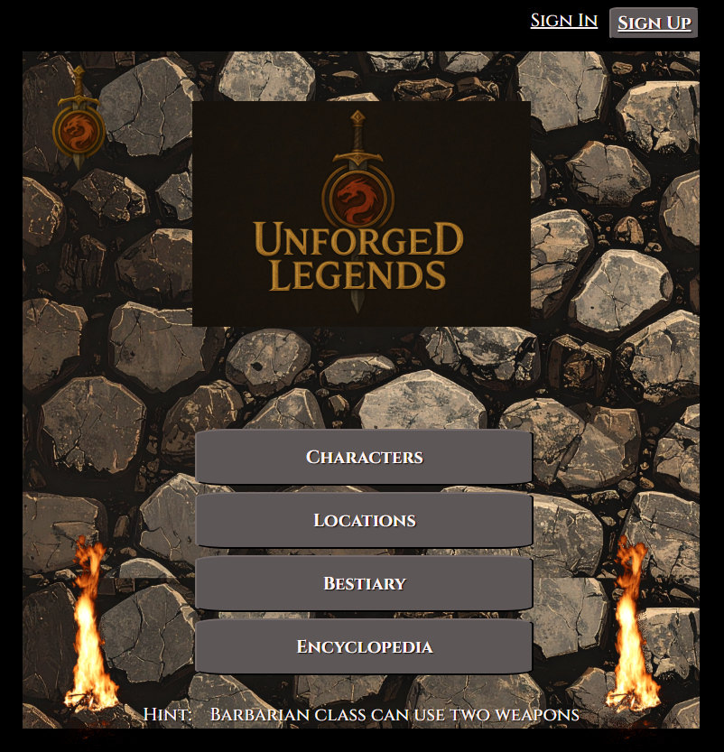
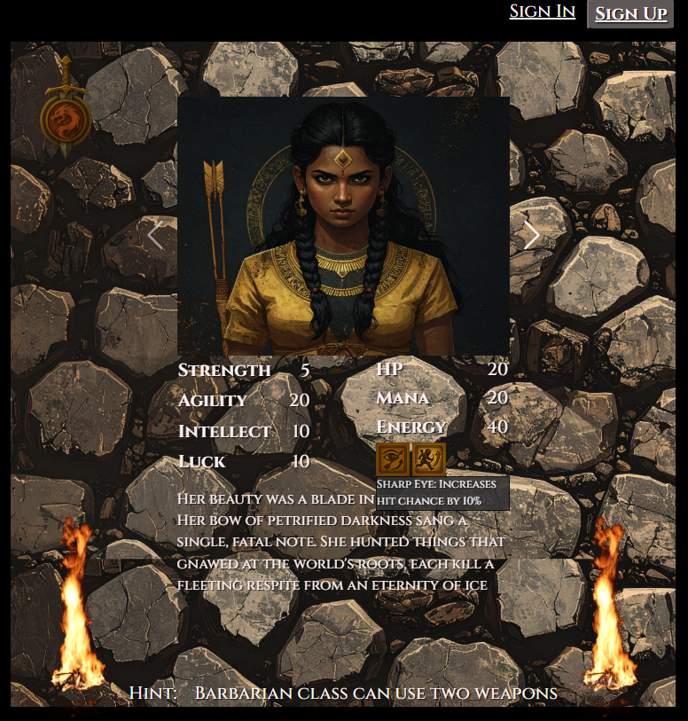
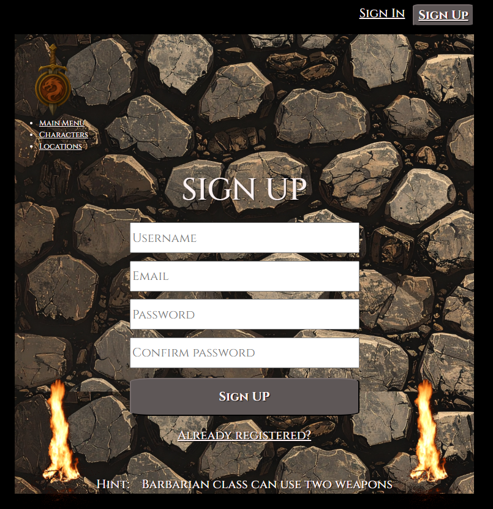
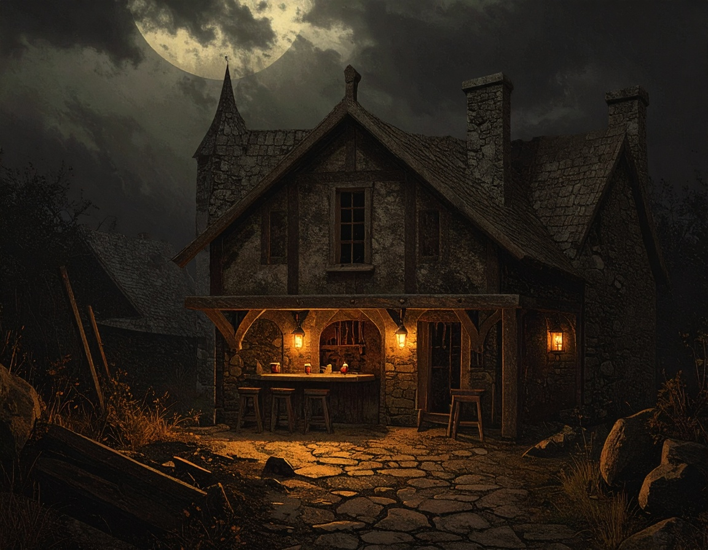
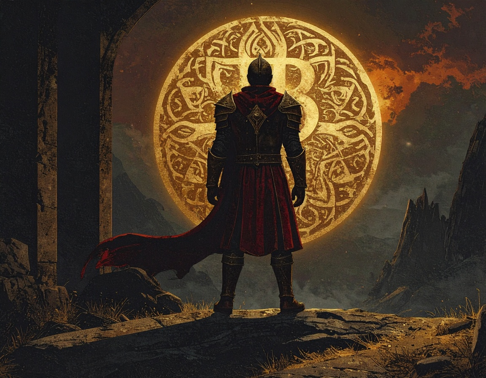
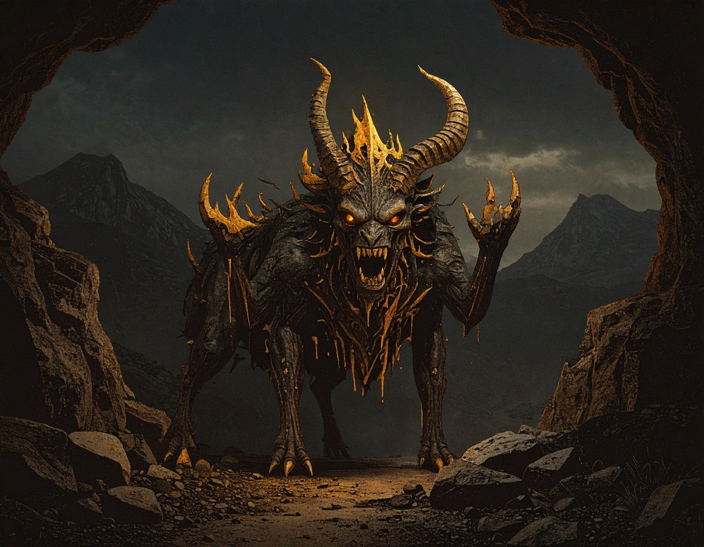

# 🏰 Unforged Legends

https://github.com/Lukatami/2025-RTT-48/tree/main/Assignments/UnforgedLegends


**Unforged Legends** is a fantasy-themed web project that serves as the foundation for a role-playing adventure hub. It provides an immersive UI for navigating character, locations, bestiary, and encyclopedia features — all wrapped in a dark, medieval aesthetic.

## ✨ Features

- 🎭 **Character Explorer** – Explore your heroes with detailed customization
- 🌍 **Locations Explorer** – Preview lore-rich places through an interactive Bootstrap carousel
- 📚 **Bestiary & Encyclopedia** – Placeholder sections for future monster and world lore expansion
- 🔑 **Authentication Pages** – Sign In & Sign Up screens with fantasy-styled UI
- 🔥 **Atmospheric Design** – Animated fire elements, medieval fonts, and stone textures
- 💡 **Dynamic Hints** – Random gameplay tips displayed on the main screen
- 🎨 **AI Generated images** – Almost everything you meet on this project is specially generated by AI

## 🛠 Tech Stack

- **Frontend**: HTML5, CSS3, Bootstrap 5
- **Typography**: Google Fonts (Cinzel)
- **Planned**: Vanilla JavaScript for enhanced interactivity
- **Icons**: Custom and Font Awesome
- **Design**: Custom fantasy styling with CSS animations

## 📂 Project Structure

```bash
├── 📁 images/              # Assets (logos, icons, fire animations, textures)
├── 📄 main.html            # Main menu and landing page
├── 📄 signIn.html          # Sign In page
├── 📄 signUp.html          # Sign Up page
├── 📄 charConstructor.html # Character creation interface
├── 📄 locations.html       # Locations carousel explorer
├── 📄 mainGridStyle.css    # Global styles and theming
└── 📄 README.md            # Project documentation
```

## 🚀 Getting Started

1. Clone this repository:
   ```bash
   git clone https://github.com/Lukatami/2025-RTT-48.git
   ```
2. Open [main.html] /2025-RTT-48/Assignments/UnforgedLegends/main.html in your browser.
3. Navigate through menus (Characters, Locations, Sign In, Sign Up).

No build process is required — it’s pure HTML & CSS with Bootstrap CDN.

## Future Roadmap

- [ ] Backend integration for authentication (Node.js / Django / etc.)

- [ ] Expand Bestiary and Encyclopedia with interactive entries.

- [ ] Skill trees and class progression.

- [ ] Dark-fantasy sound effects & background music.

- [ ] Mobile-first responsive redesign.

- [ ] Game engine and gameplay!

## 🎨 Preview












